# BroilerHub User Manual

## Introduction

BroilerHub helps poultry farm owners, managers, and workers record and review daily broiler farm activities. The app supports farm setup, batch management, feed records, mortality records, vaccination schedules, expenses, sales, reports, reminders, and offline data entry.

## Who Uses The App

BroilerHub has three main user roles:

- Owner: manages farms, creates staff accounts, records farm activity, views reports, and reviews performance.
- Manager: supervises farm operations, manages batches, records expenses and sales, and views reports.
- Worker: records daily operational data such as feed, mortality, and vaccinations.

## Getting Started

Open the BroilerHub app on your Android device. If you already have an account, enter your email and password, then tap **Login**.

If you are the farm owner and do not have an account yet, tap **Register** from the login screen and create the owner account first. Staff accounts should be created by the owner from inside the app.

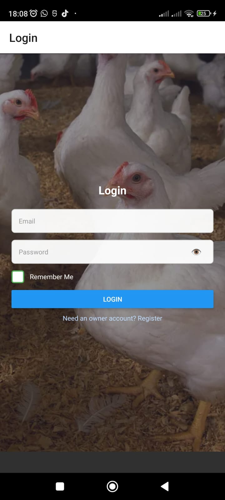

*Login screen*

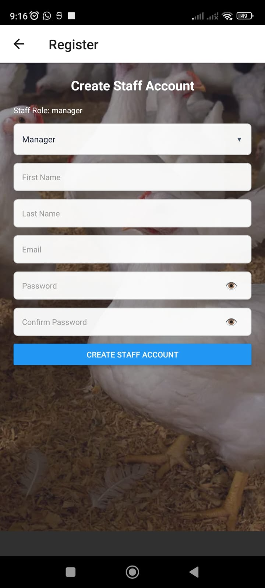

*Registration screen*

## Login Help

Use the same email address and password that were used when the account was created. Email matching is not case-sensitive, but the password must be entered correctly.

If login fails, check the email and password, then try again. If the account was restored from backup, make sure the device has internet access.

## Dashboard

The dashboard is the main screen after login. From the dashboard, users can open farm management, batch management, reports, search, reminders, recovery question setup, and help.

The options shown may differ depending on whether the user is an owner, manager, or worker.

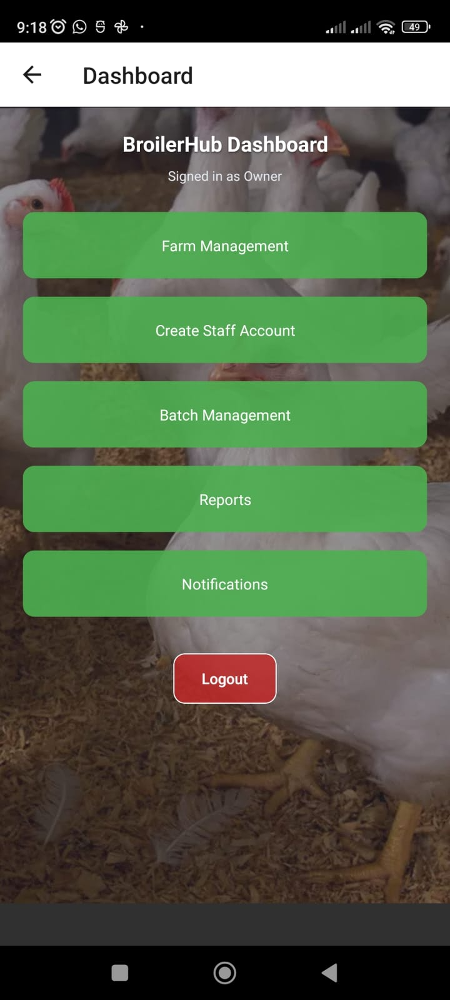

*Dashboard screen*

## Farm Management

Farm management is mainly used by owners and managers.

To add a farm:

1. Open **Farm Management**.
2. Tap **Add Farm**.
3. Enter the farm name and location.
4. Save the farm.

Use the farm list to view farms, open farm performance, or choose a farm before managing batches.

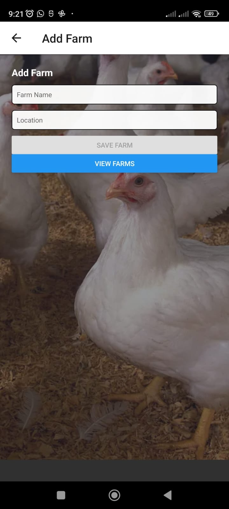

*Add farm screen*

## Batch Management

Batches are created under a farm. A batch represents a group of birds being managed together.

To create a batch:

1. Open **Batch Management**.
2. Select the correct farm.
3. Tap **Record Batch** or **Create Batch**.
4. Enter the start date, breed, initial chicks, and chick purchase cost.
5. Save the batch.

Always select the correct farm and batch before recording feed, mortality, vaccination, expense, or sales data.

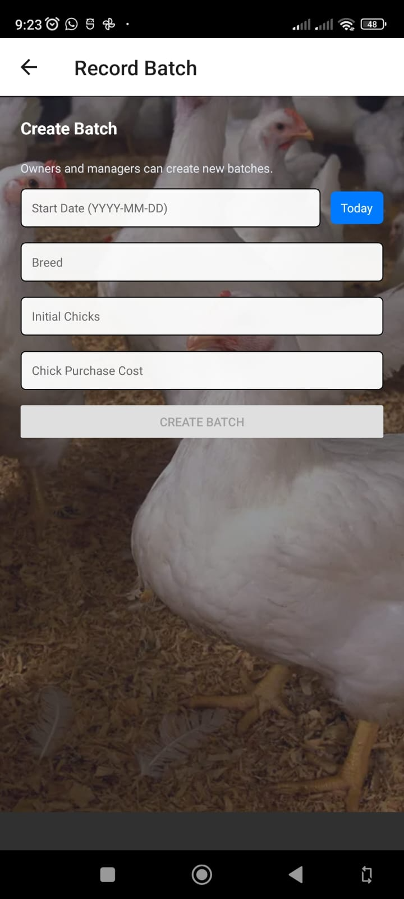

*Create batch screen*

## Feed Recording

Use feed records to track feed usage for a batch.

To record feed:

1. Open the correct batch.
2. Tap **Record Feed**.
3. Select the feed type: starter, grower, or finisher.
4. Enter the feed quantity.
5. Save the feed record.

The app may warn you if the selected feed type does not match the recommended feed stage for the batch age.

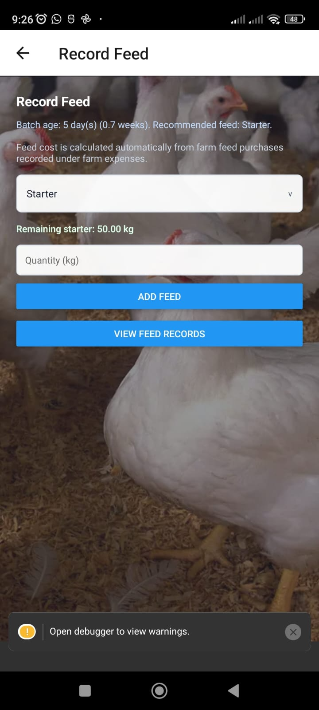

*Feed recording screen*

## Mortality Recording

Use mortality records to track bird deaths and causes.

To record mortality:

1. Open the correct batch.
2. Tap **Record Mortality**.
3. Enter the number of dead birds.
4. Enter the cause of death.
5. Save the mortality record.

Mortality data helps reports calculate total deaths and mortality rate.

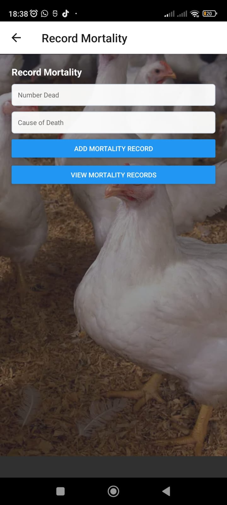

*Mortality recording screen*

## Vaccination Management

Use vaccination records to track completed vaccinations and upcoming due dates.

To record vaccination:

1. Open the correct batch.
2. Tap **Record Vaccination**.
3. Select or enter the vaccine name.
4. Enter the vaccination date.
5. Enter the next due date if follow-up is needed.
6. Add notes if needed.
7. Save the vaccination record.

Upcoming vaccination dates can appear in reminders.

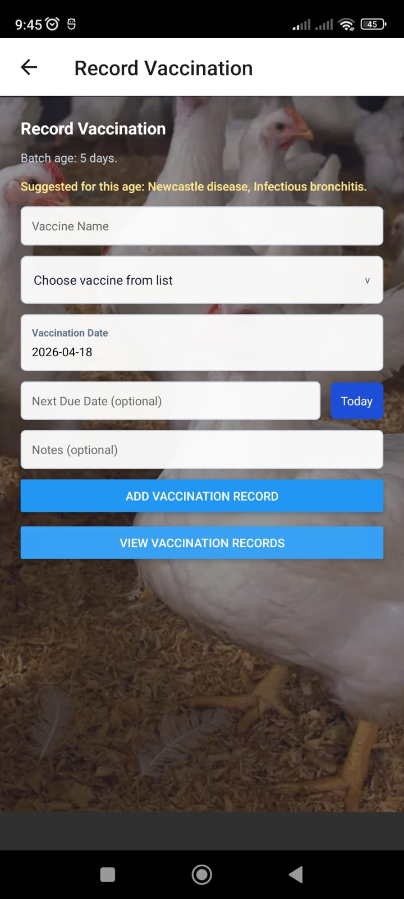

*Vaccination screen*

## Expenses

Expenses can be recorded for a whole farm or for a specific batch, depending on the screen and selected target.

To record an expense:

1. Open the correct farm or batch.
2. Tap **Record Expense**.
3. Enter the expense description.
4. Enter the amount.
5. Save the expense.

For farm feed or vaccine purchases, select the correct purchase type and quantity so the app can calculate remaining stock correctly.

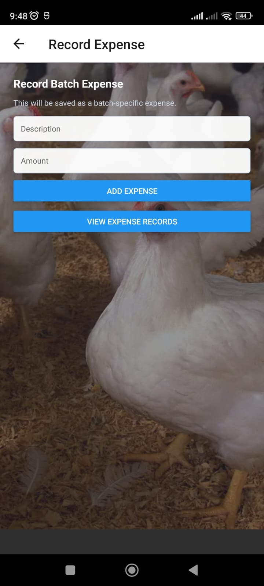

*Expense entry screen*

## Sales

Use sales records to track birds sold and revenue.

To record a sale:

1. Open the correct batch.
2. Tap **Record Sales**.
3. Enter the number of birds sold.
4. Enter the price per bird.
5. Save the sale.

The app blocks sales that exceed the available birds in the batch.

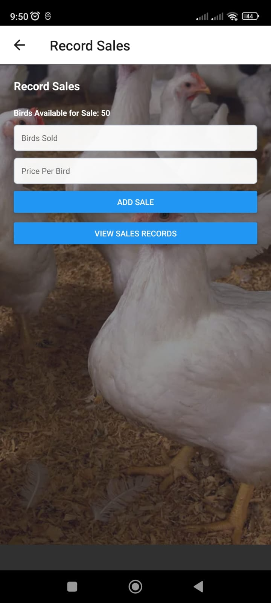

*Sales recording screen*

## Reports

Reports help users review farm and batch activity. Available reports include batch, sales, expense, feed, mortality, and vaccination reports.

Use the filters to narrow reports by date, farm, batch, or report type. Reports can also be exported to Excel when export is available on the device.

## Reminders

The reminders screen shows important alerts such as vaccination follow-ups and operational notices. Open reminders regularly to check unread messages and mark items as read when handled.

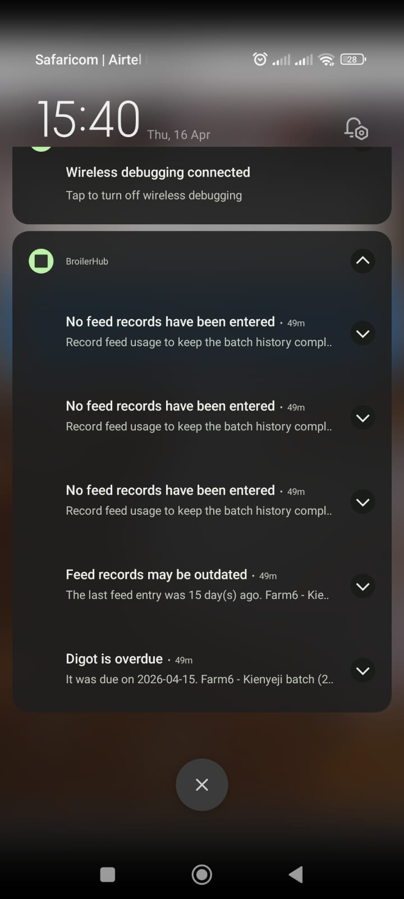

*Reminder screen*

## Offline Use

BroilerHub is designed to work offline first. Records entered without internet are saved on the device.

When internet access becomes available, the app can sync pending backup data. If sync fails, keep using the app and try refreshing again later.

## Roles And Permissions

Owner users can manage farms, create staff accounts, manage records, view reports, and review farm performance.

*Owner dashboard*

Manager users can manage batches, record expenses and sales, view reports, and monitor farm activity.

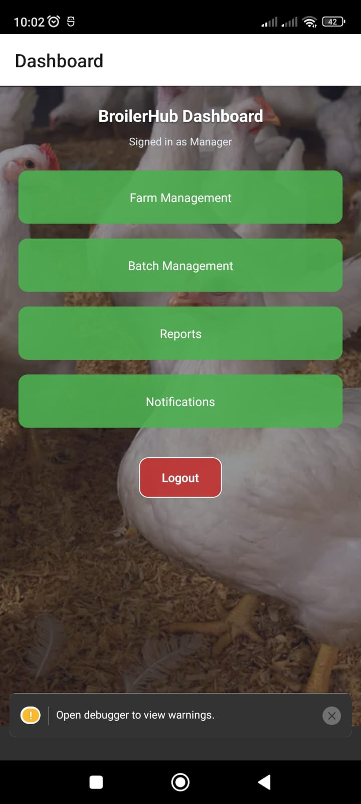

*Manager interface*

Worker users can record operational data such as feed, mortality, and vaccination records.

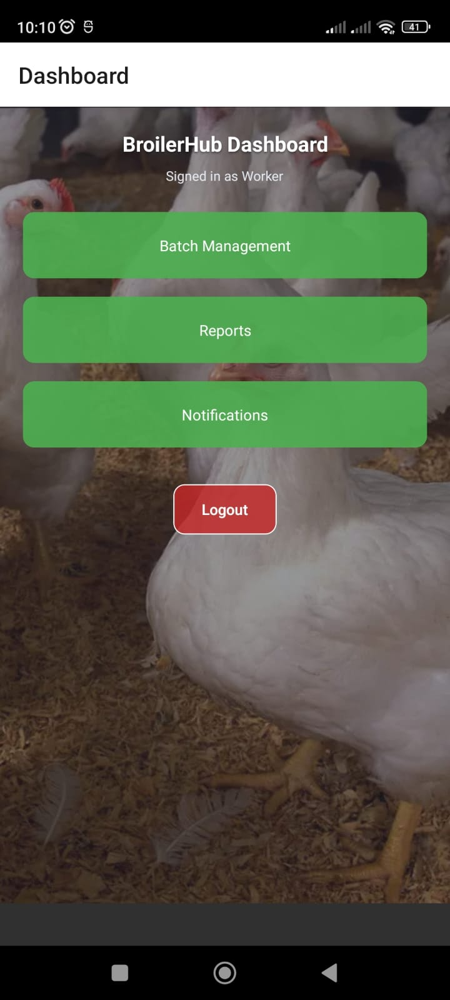

*Worker interface*

Some actions may be hidden or blocked if your role does not have permission.

## Troubleshooting

If you cannot login, confirm the email and password, then try again.

If data is not syncing, check the internet connection and refresh the dashboard.

If reports look incomplete, confirm that records were saved under the correct farm and batch.

If the app is not responding, close and reopen it, then try the action again.

If a completed batch blocks new entries, this is expected. Completed batches keep past records available but prevent new feed, mortality, vaccination, expense, and sales entries.

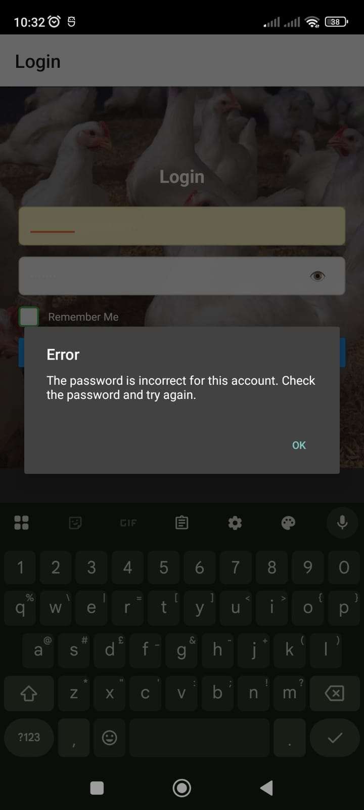

*Error message example*

## Support

Use the offline Help screen inside the app for quick guidance. Use this online user manual when internet is available and you need more detailed instructions.
